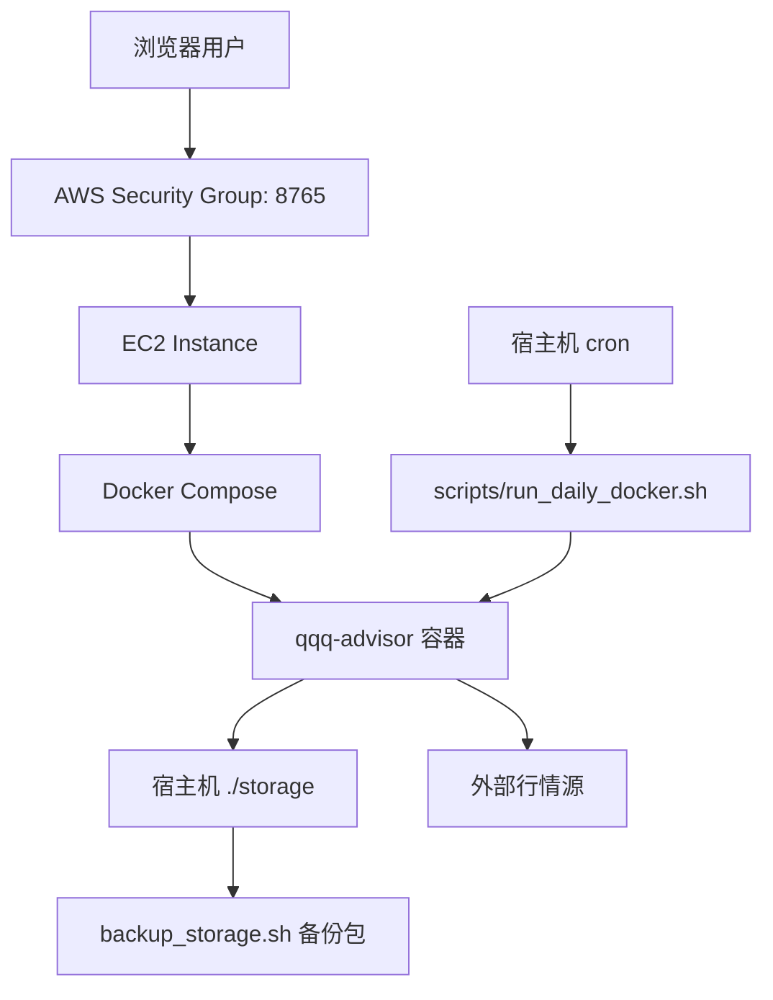

# QQQ Advisor 云服务器部署运维项目案例

## 1. 项目定位

这是一个个人量化辅助 Web 服务，用来每日拉取 QQQ / 纳指相关行情，计算趋势、均线、RSI、回撤、波动率等指标，并生成基金买入/观望建议。项目最初是本地 Python 脚本，后续被改造成可在云服务器长期运行、可一键部署、可定时任务、可备份迁移的轻量级生产服务。

面试中可以把它讲成：我把一个本地脚本工程，完整落地成了一个具备部署、持久化、定时任务、认证、日志、数据源容灾和迁移能力的小型运维项目。

## 2. 我的职责

- 设计云服务器部署方案，选择 Docker Compose 承载服务。
- 改造应用配置，让代码和数据分离，便于迁移和备份。
- 编写一键部署脚本，自动安装 Docker、cron、初始化数据、启动服务。
- 设计每日自动任务，定时生成报告并写日志。
- 增加服务启停脚本，降低日常运维复杂度。
- 处理 AWS EC2 / Amazon Linux 上的真实兼容问题。
- 增加多行情源 fallback，解决公网源限流和接口不稳定。
- 完善故障排查路径，让问题能从日志、命令和返回值定位。

## 3. 技术栈

| 模块 | 选型 |
|---|---|
| 应用 | Python 标准库 HTTP Server |
| 前端 | 静态 HTML/CSS/JS |
| 容器 | Docker |
| 编排 | Docker Compose |
| 定时任务 | 宿主机 cron 调用容器命令 |
| 数据持久化 | 宿主机 `storage/` bind mount |
| 认证 | HTTP Basic Auth |
| 云环境 | AWS EC2 / Amazon Linux 2023 |
| 代码协作 | GitHub |

## 4. 架构设计



关键设计点：

- 容器只承载运行环境和代码。
- 所有可变数据都放在宿主机 `storage/`。
- `storage/config.json` 保存用户配置。
- `storage/data/` 保存报告、日志、模型参数、缓存。
- 迁移时只需要迁移 `storage/`，代码可以重新 clone 和构建。

## 5. 一键部署流程

仓库提供 `deploy.sh`，新机器上只需要：

```bash
git clone git@github.com:Tansty/qqq.git
cd qqq
./deploy.sh
```

脚本自动完成：

- 检测并安装 Docker。
- 安装 Docker Compose 插件。
- 检测并补装 Docker Buildx。
- 安装 cron / cronie。
- 生成 `.env` 和随机网页登录密码。
- 初始化 `storage/config.json` 和 `storage/data/`。
- 构建并启动 `qqq-advisor` 容器。
- 安装每日定时任务。

部署完成后访问：

```text
http://EC2公网IP:8765
```

默认用户名：

```text
advisor
```

密码由 `deploy.sh` 首次生成，写入 `.env`。

## 6. 日常运维命令

| 场景 | 命令 |
|---|---|
| 一键部署/更新 | `./deploy.sh` |
| 重启服务 | `./restart.sh` |
| 停止服务 | `./stop.sh` |
| 查看容器 | `sudo docker compose ps` |
| 查看日志 | `sudo docker compose logs --tail=120 qqq-advisor` |
| 手动跑日报 | `sudo docker compose exec -T qqq-advisor python3 qqq_agent.py daily --config /app/storage/config.json` |
| 备份数据 | `./scripts/backup_storage.sh` |
| 安装定时任务 | `./scripts/install_cron_daily.sh` |
| 卸载定时任务 | `./scripts/uninstall_cron_daily.sh` |

## 7. 定时任务设计

使用宿主机 cron，而不是容器内部 crond。

原因：

- 宿主机 cron 更透明，出问题可以直接 `crontab -l` 排查。
- 容器专注运行 Web 服务，不混入多进程管理。
- 任务命令通过 `docker compose exec -T` 进入容器，使用同一份代码和环境变量。

默认 cron：

```cron
0 7 * * 2-6 cd /home/ec2-user/qqq && ./scripts/run_daily_docker.sh # qqq-advisor-daily
```

含义：

- 中国时区周二到周六早上 07:00。
- 对应美股周一到周五收盘后。
- 日志写入 `storage/logs/daily-YYYYMMDD.log`。

## 8. 数据持久化与迁移

项目把可变数据集中到：

```text
storage/
  config.json
  data/
  logs/
```

备份：

```bash
./scripts/backup_storage.sh
```

迁移：

```bash
tar -czf qqq-storage.tar.gz storage
scp qqq-storage.tar.gz 新服务器:/home/ec2-user/qqq/
tar -xzf qqq-storage.tar.gz
./deploy.sh
```

这个设计保证：

- 容器重建不丢数据。
- Git pull 不覆盖用户配置。
- 新服务器恢复成本低。
- 数据迁出不依赖数据库专有格式。

## 9. 行情数据源容灾

项目一开始只依赖 Stooq 和 Yahoo，但在云服务器上遇到了几个真实问题：

- Yahoo 在 EC2 公网 IP 上返回 `429 Too Many Requests`。
- Stooq 偶发 SSL EOF、超时或返回数据不足。
- Nasdaq charting 接口会返回 `403 Forbidden`。
- 页面抓取源字段结构不稳定。

最终设计了多级 fallback：

```text
Twelve Data
  -> Tiingo
  -> Investing financialdata
  -> Google Finance
  -> Nasdaq charting
  -> Stooq
  -> Yahoo
  -> 本地缓存/最近报告
```

如果配置 API key，优先用 Twelve Data / Tiingo。没有 key 时，尝试 Investing 的历史行情 JSON endpoint。

Investing 接口样例：

```text
https://api.investing.com/api/financialdata/historical/20?start-date=...&end-date=...&time-frame=Daily&add-missing-rows=false
```

解析字段：

- 日期：`rowDateTimestamp` / `rowDateRaw`
- 收盘：`last_closeRaw`
- 成交量：`volumeRaw`

为了提高可用性，行情最低要求从 220 条降到 100 条。如果不足 200 条，长期均线使用可用最长窗口近似，避免因为 MA200 直接中断。

## 10. 认证与安全

线上服务默认启用 Basic Auth：

```bash
QQQ_ADVISOR_USERNAME=advisor
QQQ_ADVISOR_PASSWORD=随机生成
```

安全控制：

- `.env` 不提交 Git。
- `config.json` 不提交 Git。
- `storage/` 不提交 Git。
- GitHub 中只保留代码、模板和初始 seed 数据。
- AWS Security Group 只开放服务端口。

建议生产改进：

- 用 Nginx / Caddy 加 HTTPS。
- 安全组来源限制为自己的公网 IP。
- 密码定期轮换。
- 备份包同步到对象存储。

## 11. AWS EC2 排障记录

### 11.1 服务本机通，公网不通

现象：

```bash
curl -i http://127.0.0.1:8765
HTTP/1.0 401 Unauthorized
```

说明服务已启动，401 是 Basic Auth 正常响应。

排查方向：

- EC2 是否有 Public IPv4。
- 浏览器是否访问公网 IP，而不是 `172.31.x.x` 私网 IP。
- Security Group 入站是否放行 TCP 8765。
- 子网路由表是否有 `0.0.0.0/0 -> igw-xxxx`。
- 本地运营商/公司网络是否屏蔽高端口。

### 11.2 Amazon Linux 不支持 Docker 官方安装脚本

报错：

```text
ERROR: Unsupported distribution 'amzn'
```

处理：

- 针对 `ID=amzn` 使用 `yum` / `dnf install docker`。
- 启动并 enable Docker service。
- 将 `ec2-user` 加入 docker 组。
- 在当前 session 尚未生效时，脚本自动用 `sudo docker` 兜底。

### 11.3 Docker Compose 需要新版 buildx

报错：

```text
compose build requires buildx 0.17.0 or later
```

处理：

- `deploy.sh` 检测 buildx 版本。
- 低版本时自动下载新版 buildx 插件。
- 如果下载失败，使用 `docker build` 兜底，再 `docker compose up --no-build`。

### 11.4 `.env` 中 cron 表达式导致 shell 执行失败

报错：

```text
.env: line 8: 7: command not found
```

根因：

```bash
QQQ_DAILY_CRON=0 7 * * 2-6
```

shell source 时把 `7` 当成命令。

处理：

- `.env` 改成：

```bash
QQQ_DAILY_CRON="0 7 * * 2-6"
```

- 所有脚本不再直接 `source .env`，改为安全解析 key/value。
- `deploy.sh` 会自动修复旧的未加引号 cron 行。

### 11.5 前端报 `Unexpected end of JSON input`

现象：

```text
Failed to execute 'json' on 'Response': Unexpected end of JSON input
```

处理：

- 前端先读取 response text。
- 为空时显示“服务端返回空响应”。
- 非 JSON 时显示前 220 字符。
- 非 200 时显示后端 `error` 字段。

这样能避免前端把后端错误吞掉，便于排查。

## 12. 可观测性

当前具备：

- Web 容器日志：`docker compose logs`
- 每日任务日志：`storage/logs/daily-YYYYMMDD.log`
- 每日报告：`storage/data/report-YYYY-MM-DD.json`
- Agent 状态：`storage/data/agent_state.json`
- 演进日志：`storage/data/evolution_log.json`

可继续增强：

- 增加 `/healthz` 健康检查接口。
- Docker Compose 配置 healthcheck。
- 日志轮转，避免长期占用磁盘。
- 任务失败后通过邮件/Telegram/企业微信通知。
- 接入 Prometheus node exporter 或 CloudWatch Agent。

## 13. 项目亮点总结

面试时可以重点讲这几点：

1. **把脚本服务化**
   本地 Python 脚本改造成云上可访问 Web 服务，容器化部署。

2. **一键部署**
   `deploy.sh` 自动处理 Docker、Compose、Buildx、cron、配置、数据目录和启动流程。

3. **代码数据分离**
   代码走 Git，数据走 `storage/`，迁移和备份清晰。

4. **真实云环境排障**
   解决 Amazon Linux Docker 安装、Buildx 版本、EC2 安全组、Basic Auth、接口限流等问题。

5. **自动化运维**
   定时任务每日运行，日志落盘，支持一键重启和关闭。

6. **容灾意识**
   多行情源 fallback，远端失败时使用本地缓存或最近报告，不让服务直接不可用。

7. **安全意识**
   线上默认 Basic Auth，敏感配置不提交 Git，建议安全组最小开放。

## 14. 面试讲述模板

可以这样讲：

> 我最近做了一个轻量级运维实践项目。原始项目只是一个本地 Python 行情分析脚本，我把它改造成了能部署在 AWS EC2 上的容器化 Web 服务。部署层面，我写了 `deploy.sh`，可以在 Amazon Linux 上自动安装 Docker、Compose、Buildx 和 cron，然后初始化持久化目录、生成登录密码、构建镜像并启动服务。数据层面，我把配置和运行数据放到宿主机 `storage/`，实现代码和数据分离，迁移时只需要打包 storage。运维层面，我加了每日 cron 自动任务、日志落盘、一键重启/停止、备份脚本。上线过程中还处理了 EC2 安全组、Docker 官方脚本不支持 Amazon Linux、buildx 版本过低、Yahoo 429 限流、接口 fallback 等问题。这个项目虽然规模不大，但覆盖了部署、自动化、持久化、排障、安全和容灾这些运维基本能力。

如果面试官追问“为什么不用 Kubernetes”，可以回答：

> 这个服务是单实例、低并发、状态文件较少的个人工具，用 Docker Compose 更符合当前规模。先把自动部署、数据持久化、备份、日志和定时任务做好，比直接上 K8s 更合适。如果后续多用户化或需要高可用，再考虑 ECS/K8s、RDS、对象存储和监控告警。

## 15. 后续优化路线

- 使用 Caddy/Nginx 自动 HTTPS。
- 将 `storage/` 定期同步到 S3。
- 增加 `/healthz` 和 Compose healthcheck。
- 增加 webhook 通知每日任务失败。
- 用 GitHub Actions 做语法检查和 Docker build。
- 将行情抓取独立成数据采集 job。
- 把 JSON 文件迁移到 SQLite，提升查询和并发写入安全性。
- 使用 Terraform 管理 EC2、安全组、Elastic IP 等基础设施。
